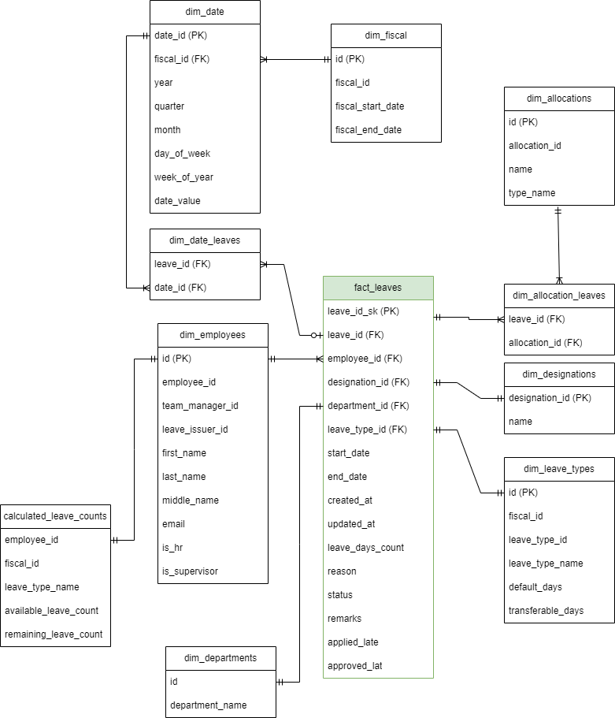

# Leave Visualization Pipeline

## Description
A data pipeline that is used to handle various data sources to insert data into a data warehouse. The pipeline is designed to be deployed in AWS Lambda but can also be used outside of AWS Lambda.

## Installation
Initially you have to set up the `.env` file. An example `.env` file has been provided in the repo
Installation can be conducted in few different ways:
1. Using requirements file directly
```
pip install requirements.txt
python main.py --path <AWS KEY> --bucket <AWS BUCKET>
```

## Contents
The pipeline has several portions to it, They are:

### SQL
All the SQL queries that are required to insert data into various tables in different stages of the pipelines reside in the `/src/sql` folder. The queries with regards to stages are separated by using folders within.

### Procedure
The folder `/src/procedures` is used to store the procedures. Any procedure required for the pipeline are defined here.

### Schema
The folder `/src/schema` is used to store all the required DDL of the tables in the pipeline and the warehouse. <br>


### Interface
The pipeline uses a Factory design pattern. It consists of a single interface called `SourceInterface`. This interface consists of all the generic methods that may be necessary for any different data sources. Except for the raw data extraction and transformation, all the other methods are pre implemented.

### Sources
The pipeline requires the ability to handle different sources. Currently the pipeline can handle two different sources, API and JSON. For each different source a different class has been described which inherits the `SourceInterface`. The source class has the extraction and transformation methods defined in them. For other stages they call the parent class with a database instance. <br>
for any new source type, such as `csv` one can easily add a new Csvhandler class and scale the code for handling varying file format.

### Factory
The `SourceFactory` residing in `/src/factory` directory is used to determine the source handler for the given input event.

