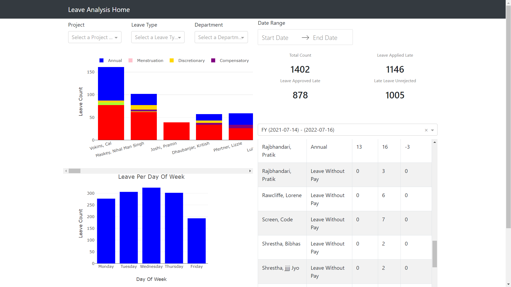

# Leave Visualization system

## Description
It is a sample project on creating a dashboard using the Python Dash and Postgresql. 

## Installation
Initially you have to set up the `.env` file. An example `.env` file has been provided in the repo
Installation can be conducted in few different ways:
1. Using setup.py file
```
pip install .
python wsgi.py
```

2. Using requirements file directly
```
pip install requirements.txt
python wsgi.py
```

3. Using Docker file
```
docker build -t image-name .
docker run -d -p local-port:container-port image-name
```

## Contents
The application code resides on the app directory. The application is further divided into `api` and `dashapp`.

<hr>

### api
The api folder contains the backend portion of the application. Here a flask application is passed in order to create API endpoints. 
To create any endpoint make sure to use the `api_router_v1` so as to automatically register the endpoint to the path.
There are a few API endpoints already defined there. The defined API endpoints are as follows:

#### /v1/api/leave/per-weekday
This endpoint is used to get the leave for each day of the week. A sample of the output from that endpoint is:
```
{
    "count": [
        277,
        306,
        324,
        302,
        193
    ],
    "day_of_week": [
        "Monday",
        "Tuesday",
        "Wednesday",
        "Thursday",
        "Friday"
    ]
}
```

#### /v1/api/leave/metrics
This endpoint is used to get calculated metrics. Additional metrics can be calculated here if needed. A sample of the output is as follows:
```
[
    {
        "late_applied_leave": 1146,
        "late_applied_leave_not_rejected": 1005,
        "late_approved_leave": 878,
        "total_count": 1402
    }
]
```

#### /v1/api/leave/highest-count
This endpoint provides the name of the employee and the leave count, with regards to the leave type. It only gets the leaves which aren't canceled or rejected. A sample output from the endpoint is:
```
[
    {
        "leave_counts": {
            "Annual": 74,
            "Discretionary": 4,
            "Leave Without Pay": 77,
            "Sick": 6
        },
        "name": "Vokins, Cal"
    }....
]
```

#### /v1/api/leave/balance
This endpoint gets the leave remaining, applied for each employee for a fiscal year. It only gets the leaves which aren't canceled or rejected. A sample output from the endpoint is:
```
[
    {
        "available_leave_count": 0,
        "full_name": "Aryal, Rashmi",
        "leave_type_name": "Leave Without Pay",
        "leaves_taken": 2,
        "remaining_leave_count": 0
    }
]
```

#### /v1/api/leave/filter-options
This API pulls all the data that are required for the filters used in the dashboard. Sample output is:
```
{
    "date_range_lower": "07/14/2021",
    "date_range_upper": "07/15/2024",
    "departments": [
        {
            "label": "HR and Administration",
            "value": "HR and Administration"
        }
    ],
    "fiscal_years": [
        {
            "label": "FY (2021-07-14) - (2022-07-16)",
            "value": 1
        }
    ],
    "leave_types": [
        {
            "label": "Leave Without Pay",
            "value": "Leave Without Pay"
        }
    ],
    "projects": [
        {
            "label": "API Test Project three",
            "value": "API Test Project three"
        }
    ]
}
```

<hr>

### Dashapp
A single page application has been created in the dashapp. The dash application has few components.

#### Route
The route in maintained in the index.py file. Here, with regards to the route different page layout and callbacks are registered.

#### Page Layout
The page layout is maintained within the pages folder. Each file in page_layout is maintained by a single python file. The base_layout file works as a wrapper for all the other page files.

#### Callbacks
The callbacks folder is used to maintain the callbacks. Each py file in callback file is used for a different page. Here API calls are maintained as well.


A sample page can be seen as follows:


